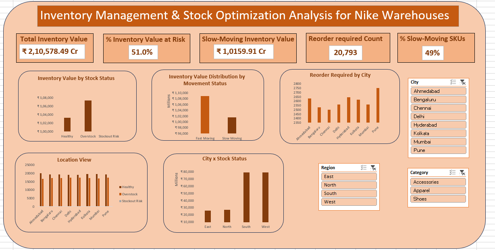
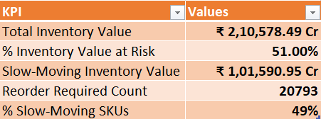

# 🏷️ Inventory Management & Stock Optimization Analysis  
**Industry:** Retail / Supply Chain (Sportswear – Nike India)  
**Type of Analysis:** Exploratory & Diagnostic Inventory Analysis  

---

## 📊 Dashboard Preview

  

---

## 📥 Full Excel Workbook

Due to GitHub file size limitations, the complete Excel workbook (data model, calculations, pivot logic, and dashboards) is hosted externally.

🔗 **Download Excel Workbook:** <https://docs.google.com/spreadsheets/d/1ZSzjOMie4YOYLzvY_OVmIhuiCXGqHU3p/edit?usp=sharing&ouid=113450234067058885705&rtpof=true&sd=true>

---

## 🧠 Executive Summary

Nike operates across multiple warehouses and cities in India, managing thousands of SKUs daily. Inefficient inventory planning can lead to capital lock-in, overstocking, and stockout risks, directly impacting profitability and operational efficiency.

In this project, I analyzed **1 year of inventory transaction data across India** to evaluate inventory health, demand movement, and replenishment effectiveness. Using **Excel-based analytics and dashboards**, I identified slow-moving inventory risks, overstock concentration, and high-priority replenishment locations.

---

## 🔑 Key Outcomes

- ₹2,105.78 Cr total inventory analyzed  
- **51% of inventory value at risk** (primarily due to overstock)  
- ₹1,015.91 Cr locked in slow-moving SKUs  
- 20,793 SKU–warehouse combinations requiring replenishment review  
- 49% of SKUs classified as slow-moving, indicating excess assortment depth  

---

## 🚀 Business Impact

This analysis highlights opportunities to:
- Reduce excess inventory and capital lock-in  
- Improve demand-based stocking decisions  
- Optimize replenishment strategies across regions  

---

## 🧩 Business Problem

Inventory mismanagement is one of the biggest hidden cost drivers in retail supply chains.

Nike faces challenges such as:
- Overstocking of slow-moving products  
- Capital blocked in non-performing SKUs  
- Difficulty prioritizing replenishment across multiple cities  
- Limited visibility into inventory health at scale  

---

## ❓ Key Questions Addressed

- Which inventory is **healthy vs at risk**?  
- Which SKUs are **slow-moving vs fast-moving**?  
- Where is inventory value **geographically concentrated**?  
- Which locations require **immediate replenishment action**?  

This project focuses on **diagnosing inventory inefficiencies rather than forecasting**, enabling data-driven operational decisions.

---

## 🔍 Methodology

### 📊 Analysis Approach
- Exploratory and diagnostic analysis of daily inventory transactions  
- Product–warehouse level analysis for accuracy  
- Demand velocity-based inventory classification  

### 🧠 Key Techniques Used
- Inventory metrics: opening stock, closing stock, received qty, sold qty  
- Reorder logic using **Safety Stock + Lead Time**  
- Demand analysis using **Average Daily Sales**  
- Inventory movement classification:
  - Fast-moving  
  - Slow-moving  
- Risk identification:
  - Overstock  
  - Stockout risk  
  - Healthy stock  

---

## 📈 Dashboards
- KPI-driven Excel dashboard with slicers (City, Region, Category)  
- Pivot-based aggregation for transparency and auditability  
- Focus on clarity, correctness, and business interpretability (not visual gimmicks)  

---

## 🧰 Skills Demonstrated

### 🧮 Excel (Core)
- Pivot Tables & Pivot Charts  
- GETPIVOTDATA for dynamic KPIs  
- VLOOKUP & structured references  
- Conditional logic (IF, nested IFs)  
- Inventory calculations & business metrics  
- Dashboard design with slicers  

### 📦 Supply Chain Concepts
- Inventory valuation  
- Reorder point logic  
- Safety stock & lead time  
- Inventory aging & movement analysis  
- Demand-based decision making  

*(SQL, Power BI, and Python are planned extensions for future iterations.)*

---

## 📌 Results & Business Recommendations

### 🔍 Key Findings
- Overstock is a larger issue than stockouts, indicating capital inefficiency  
- Slow-moving SKUs persist across warehouses, pointing to product-level demand issues  
- South and West regions hold the highest inventory value concentration  
- Replenishment pressure is distributed across major cities rather than isolated locations  

### ✅ Recommendations
- Reduce stock depth for slow-moving SKUs to prevent further overstock accumulation  
- Reallocate inventory from high-overstock regions using inter-warehouse transfers  
- Prioritize fast-moving SKUs for replenishment to avoid revenue loss  
- Adopt movement-based inventory reviews instead of last-sale logic  

---

## 🚀 Next Steps & Limitations

### 🔮 Next Steps
- Implement the same model using SQL for scalable querying  
- Build a Power BI dashboard with real-time refresh and drill-downs  
- Add forecasting models for proactive inventory planning  
- Introduce SKU rationalization analysis to reduce assortment complexity  

### ⚠️ Limitations
- Dataset is simulated and excludes promotions or seasonality  
- No supplier-side constraints or cost variations included  
- Forecasting and profitability analysis are outside the current scope  

Despite these limitations, the project demonstrates inventory diagnostics and decision-making logic applicable to real-world retail operations.

---

## 🏁 Conclusion

This project showcases how **structured analysis, correct KPIs, and business-focused interpretation** can uncover hidden inefficiencies in inventory operations. The emphasis is on decision-making impact rather than tools alone—an essential skill set for data analysts in supply chain and retail analytics.

